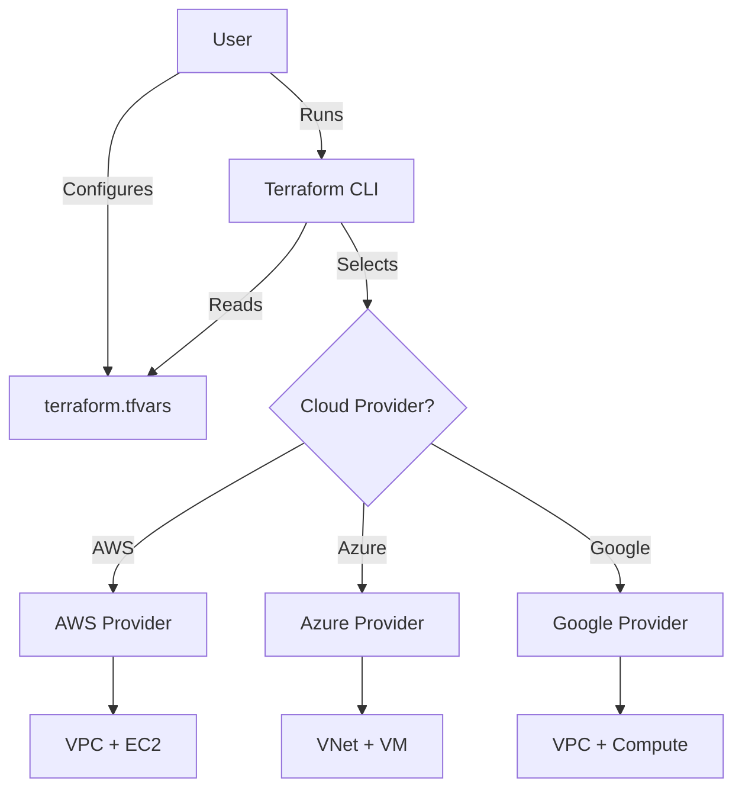

# Cloud-Agnostic IaC

This project uses Terraform to deploy basic infrastructure (Network + VM) to a **single cloud provider of your choice** (AWS, Azure, or GCP).

## Structure

- `main.tf`: Main configuration entry point.
- `variables.tf`: Variable definitions.
- `outputs.tf`: Output definitions.
- `providers.tf`: Terraform provider configurations.
- `terraform.tfvars`: Project-specific variable values.
- `modules/`: Contains reusable modules for network and virtual machines.

## Architecture



## Usage

1.  **Clone the repository.**
2.  **Initialize Terraform:**
    ```bash
    terraform init
    ```
3.  **Configure your deployment:**
    Open `terraform.tfvars` and set the `cloud_provider` variable to your desired cloud:
    ```hcl
    cloud_provider = "aws" # Options: "aws", "azure", "google"
    admin_password = "YourSecretPassword!"
     environment    = "dev"
    ```
    *Note: You must also configure the specific variables for your chosen cloud (e.g., `aws_ami`, `azure_resource_group`, `gcp_project`).*

4.  **Review the plan:**
    ```bash
    terraform plan
    ```
    This will show you that *only* the resources for your selected `cloud_provider` will be created.

5.  **Deploy:**
    ```bash
    terraform apply
    ```

## Requirements

- Terraform >= 1.0
- Cloud credentials configured in your environment (e.g., `AWS_PROFILE`, `az login`, `gcloud auth application-default login`).
